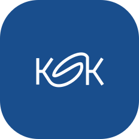

<br />
<br />

<p align="center">
    
</p>
<h1 align="center">KSK Interactive</h1>
<p align="center">
  Interactive investment portal for the region of <a href="https://web.vucke.sk/">Košice</a>
</p>

<br />

---

>[!NOTE]
> ## Current State: PoC
> This project is currently a proof of concept made during the [Hacknime.to](https://www.hacknime.to/regionalny-rozvojovy-portal/) competition that happend during 23.9 - 24.9.2024 and won the ***2. place***
>
> This project will likely stay in this form for the foreseeable future, as it was made for the competition only.

## Future Features

- [ ] 🗺️ Interactive layered map
- [ ] 🏡 List of available investment opportunities
- [ ] 📰 News feed for the region
- [ ] And more...

---

## Local Setup

> [!NOTE]
> This project uses [nodejs](https://docs.astral.sh/uv/) with [corepack](https://github.com/nodejs/corepack)

To **enable** corepack after installing node, run:
```
corepack enable
```

After that, to **install** all the node modules run:
```
pnpm install
```

To run the **development** server run:
```
pnpm run dev
```